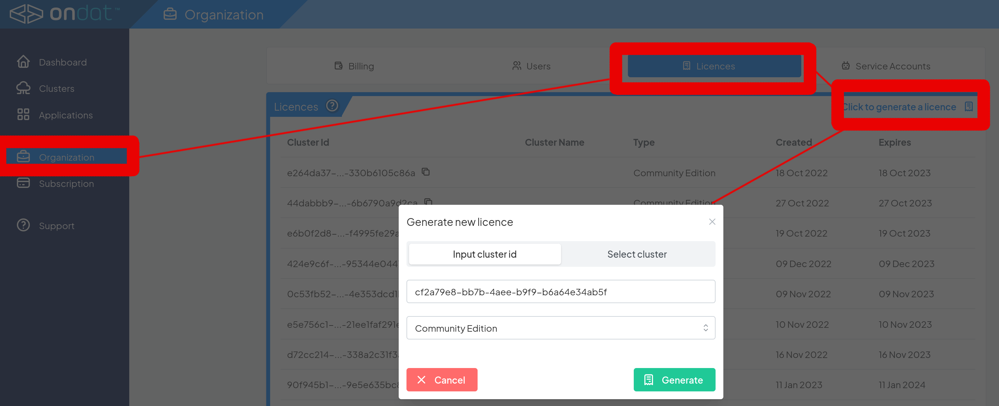

# Install and Demo of Ondat Container Native Storage on OpenShift

By the end of this challenge you, you will install Ondat into your OpenShift cluster, create a `StorageClass` and deploy a stateful application with replicated data.

To install Ondat we are going to use the Operator, this is a level 4 operator and will do the install using a `kubectl` plugin. We also use an etcd cluster for Ondat, we are also going to self-host our own etcd cluster and the Ondat operator will also orchestrate this. Not specifically part of this lab but worth noting, you can also orchestrate multiple cluster installs and get "advanced cluster storage management" information by creating an install command from the [Ondat Portal](https://portal.ondat.io). 

To install the kubectl plugin, please find the latest version from [this github link](https://github.com/storageos/kubectl-storageos). At the time of writing we are going to pickup the `v1.3.3` version as this is the current release, but please visit the github link and use the latest release. 

*NOTE that the bastion host used by RHPDS does not use /usr/local/bin, it uses /usr/local/sbin so there is an additional step we need to add to cater for the setup of RHPDS.*

To install the plugin, get the latest version from the github link above, it should be similar to the following:

```bash
curl -sSLo kubectl-storageos.tar.gz \
    https://github.com/storageos/kubectl-storageos/releases/download/v1.3.3/kubectl-storageos_1.3.3_linux_amd64.tar.gz \
    && tar -xf kubectl-storageos.tar.gz \
    && chmod +x kubectl-storageos \
    && sudo mv kubectl-storageos /usr/local/bin/ \
    && rm kubectl-storageos.tar.gz
```

As mentioned above, we also need a specific step to cater for the RHPDS setup which is:

```bash
cp /usr/local/bin/kubectl-storageos /usr/local/sbin/kubectl-storageos
```

To test that the plugin is working please run:

```bash
oc storageos version
v1.3.3
```

This completes the installation of the kubectl plugin. Once we have that installed onto a machine, and we also have a `kubeconfig` on the machine which points to the cluster we want to install Ondat onto, we are ready to go.

*NOTE we are using the "connected" install path here and pulling images from the Ondat dockerhub repo. You can also do this for disconnected clusters following the [air gap installation instructions](https://docs.ondat.io/docs/install/airgap/)*


To install Ondat, run the following command:
```bash
oc storageos install --include-etcd --etcd-replicas=3
```

This will go ahead and install Ondat and etcd into the cluster.

*NOTE there are a lot of other options you can also apply to the install, for example install metrics using `--enable-metrics`, for a complete list you can run `kubectl storageos install -h` and have a look at all the other options which are available. For now please just use the simple install as above.*

You can check that Ondat has been install successfully by running the following command:
```bash
oc get ds -n storageos
```
After a minute or so, you should get a similar output to the following:
```
NAME             DESIRED   CURRENT   READY   UP-TO-DATE   AVAILABLE   NODE SELECTOR   AGE
storageos-node   3         3         3       3            3           <none>          58s
```

Wait until you have 3 `storageos-node` `Pods` ready.

Create a StorageClass With Replication Enabled
======You can check that Ondat has been install successfully by running the following command:
```bash
kubectl get ds -n storageos
```
After a minute or so, you should get a similar output to the following:
```
NAME             DESIRED   CURRENT   READY   UP-TO-DATE   AVAILABLE   NODE SELECTOR   AGE
storageos-node   3         3         3       3            3           <none>          58s
```

Wait until you have 3 `storageos-node` `Pods` ready.

Create a StorageClass With Replication Enabled
======

Openshift, based on Kubernetes, is the defacto cloud operating system. However, when it comes to the data service layer, it doesn't provide features that are considered a given for on-premises data services. It doesn't provide replication or encryption capabilities for your data, which leaves a big feature gap when deploying stateful applications.

Let's change this by enabling replication for Openshift persistent volumes with Ondat. First, let's create an OpenShift `StorageClass` that defines 2 replicas for every volume provisioned. To do this, run the following command:
```yaml
cat <<EOF | oc apply -f -
apiVersion: storage.k8s.io/v1
kind: StorageClass
metadata:
  labels:
    app: storageos
  name: ondat-replicated
parameters:
  storageos.com/replicas: "2"
  csi.storage.k8s.io/fstype: xfs
  csi.storage.k8s.io/secret-name: storageos-api
  csi.storage.k8s.io/secret-namespace: storageos
provisioner: csi.storageos.com
reclaimPolicy: Delete
volumeBindingMode: Immediate
allowVolumeExpansion: true
EOF
```
Check that a new `StorageClass` has been created by running the following command:
```bash
oc get sc ondat-replicated
```
Result:
```
NAME               PROVISIONER         RECLAIMPOLICY   VOLUMEBINDINGMODE   ALLOWVOLUMEEXPANSION   AGE
ondat-replicated   csi.storageos.com   Delete          Immediate           true                   111s
```

Deploy a Stateful Application
======
In the previous manifest, you can notice the line: `storageos.com/replicas: "2"`. It enables volume replication, defining 2 replicas for any volume bound to that `StorageClass`. Let's create a `StatefulSet` configured with a volume dynamically provisioned by this `StorageClass`. For this, run the following command:
```yaml
cat <<EOF | oc apply -f -
apiVersion: v1
kind: Service
metadata:
  name: basic-app
  labels:
    app: basic-app
spec:
  clusterIP: None
  selector:
    app: basic-app
---
apiVersion: apps/v1
kind: StatefulSet
metadata:
  labels:
    app: basic-app
  name: basic-app
spec:
  replicas: 3
  serviceName: basic-app
  selector:
    matchLabels:
      app: basic-app
  template:
    metadata:
      labels:
        app: basic-app
    spec:
      containers:
      - image: debian:9-slim
        name: ascii-name
        command: [ "/bin/sleep", "36000"]
        volumeMounts:
        - mountPath: /mnt
          name: ondat-volume
  volumeClaimTemplates:
  - metadata:
      name: ondat-volume
      labels:
        env: dev
    spec:
      accessModes: ["ReadWriteOnce"]
      storageClassName: ondat-replicated
      resources:
        requests:
          storage: 1Gi
EOF
```

A `StatefulSet` defined using a `volumeClaimTemplate` manages `Pods` that are deployed with individual `PersistentVolumes` attached. With an Ondat `StorageClass`, `PersistentVolumes` are dynamically created through the OpenShift CSI when a `PersistentVolumeClaim` (PVC) is requested, and `VolumeClaimTemplates` automatically creates a `PVC` every time a `Pod` is provisioned.

You can verify this by executing the following command, once all `Pods` of the `StatefulSet` have been deployed:
```
watch oc get sts,pods,pvc
```
Press `CTRL+C` to stop watching.

The result should look like the following:
```
NAME                         READY   AGE
statefulset.apps/basic-app   3/3     90s

NAME              READY   STATUS    RESTARTS   AGE
pod/basic-app-0   1/1     Running   0          90s
pod/basic-app-1   1/1     Running   0          73s
pod/basic-app-2   1/1     Running   0          16s

NAME                                             STATUS   VOLUME                                     CAPACITY   ACCESS MODES   STORAGECLASS       AGE
persistentvolumeclaim/ondat-volume-basic-app-0   Bound    pvc-89116b7e-f623-4e9e-88e9-b38077eb9763   1Gi        RWO            ondat-replicated   90s
persistentvolumeclaim/ondat-volume-basic-app-1   Bound    pvc-a44454ed-f6ff-4f2b-a5ba-5b8d08cdc798   1Gi        RWO            ondat-replicated   73s
persistentvolumeclaim/ondat-volume-basic-app-2   Bound    pvc-89d9364a-e2e9-4d14-acac-c6df4851c54e   1Gi        RWO            ondat-replicated   1116sm
```
3 `Pods` have been deployed along with their `PVC`.
Now let's use the `storageos` CLI to verify the number of replicas for each volume. 

We are going to install the Ondat CLI as a pod running in the cluster and then exec into this pod to run commands. You can find the latest version of the CLI and pod install instructions at the [cli install documentation page](https://docs.ondat.io/docs/reference/cli/). At the time of writing the latest version was v2.9.0, please do check on the cli install page and make sure you use the latest version.

Copy and paste the following into your terminal:

```bash
oc create --filename -<<EOF
apiVersion: apps/v1
kind: Deployment
metadata:
  labels:
    app: storageos-cli
    app.kubernetes.io/component: storageos-cli
    app.kubernetes.io/part-of: storageos
    kind: storageos
  name: storageos-cli
  namespace: storageos
spec:
  replicas: 1
  selector:
    matchLabels:
      app: storageos-cli
  template:
    metadata:
      labels:
        app: storageos-cli
    spec:
      containers:
        - command:
            - /bin/sh
            - -c
            - while true; do sleep 3600; done
          env:
            - name: STORAGEOS_USERNAME
              valueFrom:
                secretKeyRef:
                  name: storageos-api
                  key: username
                  optional: false
            - name: STORAGEOS_PASSWORD
              valueFrom:
                secretKeyRef:
                  name: storageos-api
                  key: password
                  optional: false
            - name: STORAGEOS_ENDPOINTS
              value: storageos:5705
          image: storageos/cli:v2.9.0
          imagePullPolicy: Always
          name: cli
          ports:
            - containerPort: 5705
          resources:
            limits:
              cpu: 100m
              memory: 128Mi
            requests:
              cpu: 50m
              memory: 32Mi
          securityContext:
            allowPrivilegeEscalation: false
            readOnlyRootFilesystem: true
EOF
```

You can now run commands in the CLI pod using the following:

```bash
oc exec -ti $(oc get pods -n storageos -l app=storageos-cli -o=jsonpath='{.items[0].metadata.name}') -n storageos -- storageos get volumes -A
```
Result:
```
NAMESPACE  NAME                                      SIZE     LOCATION                ATTACHED ON    REPLICAS  AGE
default    pvc-89116b7e-f623-4e9e-88e9-b38077eb9763  1.0 GiB  ondat-worker1 (online)  ondat-worker1  2/2       1 minute ago
default    pvc-a44454ed-f6ff-4f2b-a5ba-5b8d08cdc798  1.0 GiB  ondat-worker1 (online)  ondat-worker1  2/2       1 minute ago
default    pvc-89d9364a-e2e9-4d14-acac-c6df4851c54e  1.0 GiB  ondat-worker1 (online)  ondat-worker1  2/2       39 seconds ago
```

## Apply the community license to the cluster
=====

Ondat provides a community tier of software which is free to use, this provides all of the functionality with up to 1TiB of storage. It is perfect for any development and testing use case, and there are Standard and Enterprise tiers available with up to 24x7 levels of support which you can see on the [Ondat pricing](https://www.ondat.io/pricing) page.
For the RHPDS demo we are going to use the community edition license. To generate the license we need to get the cluster id, which you can retrieve with the following cli command:

```bash
oc exec -ti $(oc get pods -n storageos -l app=storageos-cli -o=jsonpath='{.items[0].metadata.name}') -n storageos -- storageos get cluster 
ID:           cf2a79e8-bb7b-4aee-b9f9-b6a64e34ab5f 
Created at:   2023-01-12T11:00:35Z (29 minutes ago)
Updated at:   2023-01-12T11:00:36Z (29 minutes ago)
Nodes:        3                                    
  Healthy:    3                                    
  Unhealthy:  0                                    
```

We need the ID to generate the license. We can generate a license using the [Ondat portal](https://portal.ondat.io) which is free to create an account on. Please login to the portal and click on the Organisation menu, then the License tab and then click on the hyperlink to Generate a license.



This will generate a bash command you can copy and paste into the terminal, it will use a github script and base64 encodes the payload, it should look similar to the below (but please do not copy and paste the below as it will not work, use the output from the portal).

```bash
bash <(curl -sL https://raw.githubusercontent.com/ondat/portal-scripts/3294e783266fa1df96e86014e085a0fb524eee81/applyLicence.sh) Y2x1c3RlckNhcGFjaXR5R2lCOiA5MzEKY2x1c3RlcklEOiBjZjJhNzllOC1iYjdiLTRhZWUtYjlmOS1iNmE2NGUzNGFiNWYKY3VzdG9tZXJOYW1lOiBjaHJpcwpleHBpcmVzQXQ6ICIyMDI0LTAxLTEyVDExOjMzOjM0WiIKZmVhdHVyZXM6Ci0gbmZzCmtpbmQ6IHBlcnNvbmFsCgotLS0tLS0tLS0tLS0tIExJQ0VOQ0UgU0lHTkFUVVJFIC0tLS0tLS0tLS0tLS0KUkw4bnpsZnk5K01kVUswd1U2dlRmUEg2ZWNXbDZaZjJuUURPNHdYU0VLcjlCL2ZqWU92UCtTaHFBN3J2S2FCM2s1RHNndUtWcVJnN1NtU2MNCkt1TTZLRW9yWWdYaVF3Z2hYekw0UXIzUjRNS0IxNS9GUTBXR1k1ajhTWnZuYTErOGtjSDZuQmhKd1RjOWRRcWpHWGRCTFVWYnBRT2JGMFVCDQpjdUpPM1drVlJjSEJRV3dTdTFGeEVEWHlVTi85MGxFVHpLK1ExOHd4RFQvUWNnbk9kejhUNVB1anVURFVDaVhZZG5HZzhKUllDVWs0OFA5eQ0KM2pMbkNEQWhOUk1vSHBXbXhyNlZ0U0FjRU45RXNvN0Evem93Z1pSVHEzKzlMN1ljbzFvK0NTMEl2aUpsNVgrSU82L0ZUdnFKZkVZTTN3eEMNCkhPeHZKc2t1NkpsWVBleUNHTE9HYmc9PQ0K
```

We now are ready to make some changes to our storage and with the license applied you can also now keep playing with the cluster as long as needed.

## Change the Number of Ondat Volume Replicas
======

The `REPLICAS` column denotes the number of current volume replicas. 2/2 means that the volume has 2 running replicas and 2 replicas defined in the `StorageClass`.
The declarative configuration of Ondat can be complemented by imperative `oc` commands to change Ondat settings.
Let's change the number of replicas for the volumes deployed by the `StatefulSet` to 1. Run the following command:
```bash
oc label pvc --all storageos.com/replicas="1" --overwrite
```
Let's check the number of replicas for the volumes again, by executing the following command:
```bash
oc exec -ti $(oc get pods -n storageos -l app=storageos-cli -o=jsonpath='{.items[0].metadata.name}') -n storageos -- storageos get volumes -A
```
Result:
```
NAMESPACE  NAME                                      SIZE     LOCATION                ATTACHED ON    REPLICAS  AGE
default    pvc-89116b7e-f623-4e9e-88e9-b38077eb9763  1.0 GiB  ondat-worker1 (online)  ondat-worker1  1/1       2 minutes ago
default    pvc-a44454ed-f6ff-4f2b-a5ba-5b8d08cdc798  1.0 GiB  ondat-worker1 (online)  ondat-worker1  1/1       2 minutes ago
default    pvc-89d9364a-e2e9-4d14-acac-c6df4851c54e  1.0 GiB  ondat-worker1 (online)  ondat-worker1  1/1       1 minute ago
```

The number of replicas for the volumes has been changed to 1. Good job!

## Encryption of data at rest
=====

This challenge explores the Ondat encryption feature for data at rest. You are going to enable the Ondat encryption feature for your data at rest and verify the data is effectivley encrypted.


Enable Ondat Encryption for Your Volumes
======

Similarly to the replication feature, you enable Ondat volume encryption by providing declarative parameters. They can be set on the `PVC` or on the `PVCs` `StorageClass`.
However, `StorageClass` parameters cannot be changed after the `StorageClass` is created. So let's create another `StorageClass` for encryption and deploy a new `StatefulSet`. The `VolumeClaimTemplate` will use that `StorageClass` when creating the `PVCs` and the associated `PVs`.

To create the new `StorageClass`, execute the following command:

```yaml
cat <<EOF | oc apply -f -
apiVersion: storage.k8s.io/v1
kind: StorageClass
metadata:
  labels:
    app: storageos
  name: ondat-encrypted
parameters:
  storageos.com/encryption: "true"
  storageos.com/replicas: "1"
  csi.storage.k8s.io/fstype: xfs
  csi.storage.k8s.io/secret-name: storageos-api
  csi.storage.k8s.io/secret-namespace: storageos
provisioner: csi.storageos.com
reclaimPolicy: Delete
volumeBindingMode: Immediate
allowVolumeExpansion: true
EOF
```
Let's create 2 `StatefulSets`, one with encryption enabled and one without.

Let's now deploy the two manifests, firstly the encrypted one here:

```bash
cat <<EOF | oc apply -f -
apiVersion: v1
kind: Service
metadata:
  name: hamlet-encrypted
  labels:
    app: hamlet-encrypted
spec:
  clusterIP: None
  selector:
    app: hamlet-encrypted
---
apiVersion: apps/v1
kind: StatefulSet
metadata:
  labels:
    app: hamlet-encrypted
  name: hamlet-encrypted
spec:
  replicas: 1
  serviceName: hamlet-encrypted
  selector:
    matchLabels:
      app: hamlet-encrypted
  template:
    metadata:
      labels:
        app: hamlet-encrypted
    spec:
      containers:
      - image: debian:9-slim
        name: hamlet
        command: [ "sh", "-c", "echo 'My words fly up, my thoughts remain below; Words without thoughts never to heaven go' > /mnt/hamlet.txt &&sleep 3600"]
        volumeMounts:
        - mountPath: /mnt
          name: encrypted-volume
  volumeClaimTemplates:
  - metadata:
      name: encrypted-volume
      labels:
        env: dev
    spec:
      accessModes: ["ReadWriteOnce"]
      storageClassName: ondat-encrypted
      resources:
        requests:
          storage: 1Gi
EOF
```

The unencrypted `StatefulSet` manifest to apply is:

```bash
cat <<EOF | oc apply -f -
apiVersion: v1
kind: Service
metadata:
  name: hamlet-unencrypted
  labels:
    app: hamlet-unencrypted
spec:
  clusterIP: None
  selector:
    app: hamlet-unencrypted
---
apiVersion: apps/v1
kind: StatefulSet
metadata:
  labels:
    app: hamlet-unencrypted
  name: hamlet-unencrypted
spec:
  replicas: 1
  serviceName: hamlet-unencrypted
  selector:
    matchLabels:
      app: hamlet-unencrypted
  template:
    metadata:
      labels:
        app: hamlet-unencrypted
    spec:
      containers:
      - image: debian:9-slim
        name: hamlet
        command: [ "sh", "-c", "echo 'My words fly up, my thoughts remain below; Words without thoughts never to heaven go' > /mnt/hamlet.txt &&sleep 3600"]
        volumeMounts:
        - mountPath: /mnt
          name: unencrypted-volume
  volumeClaimTemplates:
  - metadata:
      name: unencrypted-volume
      labels:
        env: dev
    spec:
      accessModes: ["ReadWriteOnce"]
      storageClassName: ondat-replicated
      resources:
        requests:
          storage: 1Gi
EOF
```

There is 1 main configuration difference between them: the `storageClassName` is different. The `storageClassName` is used to specify the `StorageClass` to use when creating the `PVCs` and the associated `PVs`. The encrypted `StatefulSet` will use the `ondat-encrypted` `StorageClass`, which has encryption enabled. The unencrypted `StatefulSet` will use the `ondat-replicated` `StorageClass`, which has encryption disabled.

Verify the Data Is Encrypted
=====

Let's compare the content of the two volumes from the Kubernetes node perspective. This will make sure the system will not try to decrypt the volume when accessing the data.

First, identify the node where `Pods` are running. Run the following command:
```bash
oc get pods -owide | grep hamlet
```
Result:
```
NAME                   READY   STATUS    RESTARTS   AGE     IP           NODE            NOMINATED NODE   READINESS GATES
hamlet-encrypted-0     1/1     Running   0          77s     10.42.1.11   ondat-worker1   <none>           <none>
hamlet-unencrypted-0   1/1     Running   0          36s     10.42.0.11   ondat-worker2   <none>           <none>
```

Wait until both `Pods` are running.

!TODO! 
Let's connect to the host running the unencrypted `Pod` by running the following command:
```bash
kubectl debug no/ondat-worker2 -it --image=rhel
chroot /host
```
!TODO!

Then execute the following command:
```bash
strings /var/lib/storageos/data/dev1/vol.*.blob | grep words
```

Result:
```
My words fly up, my thoughts remain below; Words without thoughts never to heaven go
```

Exit the container by typing `exit` twice.

Now let's connect to the host running the encrypted `Pod` by running the following command:
```bash
kubectl debug no/ondat-worker1 -it --image=ubuntu
chroot /host
```

Then execute the following command:
```bash
strings /var/lib/storageos/data/dev1/vol.*.blob | grep words
```

It should not return any character, showing the volume is effectively encrypted! Good job!

Exit the container by typing `exit` twice.

## Real Application workloads and resilience in action

This challenge demonstrates how Ondat enables sateful `Pods` to run anywhere in the Kubernetes cluster without any requirement to keep their `PV` local to the node.

Traditionally, Kubernetes nodes consume local disks to provision persistent volumes. As a consequence, once a `PVC` is bound, the `Pod` consuming that `PVC`cannot be re-scheduled to a different node.
Ondat removes that limitation by allowing `Pods` to consume `PVCs` from any node in the cluster. The `Pod` always sees the volume as local, even though the volume may be located on a different node.

Deploy a PostgreSQL database using Cloud Native PostgreSQL from EDB
======

For this challenge we are going to create a postgresql pod and use the 'cnpg` plugin to check our database.

As before, please follow the latest instruction on the [Cloud Native PostgreSQL](https://github.com/cloudnative-pg/cloudnative-pg/blob/main/docs/src/installation_upgrade.md) github page. As of the time of writing the instructions were:

```bash
oc apply -f \
  https://raw.githubusercontent.com/cloudnative-pg/cloudnative-pg/release-1.18/releases/cnpg-1.18.1.yaml
```

This should apply the CNPG operator and resources to your OpenShift cluster. 

Please monitor the resources being created and once the 

We can then create a database, we are going to reuse the ondat-encrypted class from above as PostgreSQL does not provide encryption at rest.

```bash
cat <<EOF | oc apply -f -
apiVersion: postgresql.cnpg.io/v1
kind: Cluster
metadata:
  name: standalone-db
spec:
  instances: 1
  affinity:
    topologyKey: topology.kubernetes.io/zone
  postgresql:
    parameters:
      shared_buffers: "1GB"
  resources:
    requests:
      memory: "4Gi"
      cpu: 1
    limits:
      memory: "4Gi"
      cpu: 1
  storage:
    storageClass: ondat-encrypted
    size: 50Gi
  walStorage:
    storageClass: ondat-encrypted
    size: 5Gi
EOF
```

We are going to check the status of the database now using the `cnpg` plugin.

As always, please check for the latest version of the plugin at the [github cnpg page](https://github.com/cloudnative-pg/cloudnative-pg/blob/main/docs/src/cnpg-plugin.md)

The version at the time of writing and install command was as follows:

```bash
curl -sSfL \
  https://github.com/cloudnative-pg/cloudnative-pg/raw/main/hack/install-cnpg-plugin.sh | \
  sudo sh -s -- -b /usr/local/bin
```

And again, as a peculiarity of the bastion host in RHPDS, we are going to run:

```bash
cp /usr/local/bin/kubectl-cnpg /usr/local/sbin/kubectl-cnpg
```

!TODO!

```bash
oc cnpg status standalone-db
```

Result:
```bash
Cluster Summary
Name:              standalone-db
Namespace:         default
PostgreSQL Image:  ghcr.io/cloudnative-pg/postgresql:15.1
Primary instance:  
Status:             
Instances:         1
Ready instances:   0

Certificates Status
Certificate Name  Expiration Date  Days Left Until Expiration
----------------  ---------------  --------------------------

Continuous Backup status
Not configured

Streaming Replication status
Not configured

Unmanaged Replication Slot Status
No unmanaged replication slots found

Instances status
Name  Database Size  Current LSN  Replication role  Status  QoS  Manager Version  Node
----  -------------  -----------  ----------------  ------  ---  ---------------  ----
```

!TODO!

We should now be able to find the volumes in storageos and 

Check the Location of Volumes and Replicas
======

Execute the following command:
```bash
oc exec -ti $(oc get pods -n storageos -l app=storageos-cli -o=jsonpath='{.items[0].metadata.name}') -n storageos -- storageos get volumes -A
```

Result:
```bash
!TODO!
```

The `LOCATION` field denotes the node where the primary volume is provisioned.
The `ATTACHED ON` field denotes the node where the volume is currently attached, or in another words, identifies the node where the pod consuming the primary volume is running. The Ondat scheduler will try to collocate the provisioned volume with the same node where the pod is running.

Thus you should see the same node for both fields `LOCATION` and `ATTACHED ON`.

Verify Pods Can Access Volume Remotely
======

Let's force Kubernetes to re-schedule one of the `Pods` to another node, while the volume is kept local.
For this, let's first identify the node where PostgreSQL is running.

First you need to check what is the `PVC` attached to `mongodb-standalone-0`. Run the following command:
```bash
oc get pvc 
```

Result:
```bash
!TODO!
```

In the above output, you can see that ...

Identify your own node.

Once you have identified the node, run the following command to `cordon` that node (don't forget to replace the node with your own):
```bash
kubectl cordon nodename........ !TODO!
```

Verify your node is not schedulable by running the following command (don't forget to replace the node with your own):
```bash
kubectl get nodes nodename !TODO!
```

Result:
```
!TODO!
```

Then kill the `Pod` by running the following command:
```bash
kubectl delete pods .....
```

Run the following command to watch the `Pod` being re-scheduled on another node:
```bash
watch kubectl get pods ... -owide
```

Once the `Pod` is running, check the `ATTACHED ON` field again by executing the following command, replacing the volume ID with your own:

```bash
oc exec -ti $(oc get pods -n storageos -l app=storageos-cli -o=jsonpath='{.items[0].metadata.name}') -n storageos -- storageos get volumes
```

Result:
```bash

```

You can notice the volume is now attached to the node `?????`, while still being provisioned on the node `ondat-server`. Those may be different nodes in your environment.

Let's check the database:

```bash
oc cnpg status standalone-db
```

Result:
```bash
Talk about write ahead logs etc etc...
```

As you can see, the database is still happily running.

We hope you enjoyed this lab and learned a lot about Ondat and Kubernetes. For any further questions, you can reach us on our slack channel below.

**Do you need help?**

Check out the documentation at the following link: https://docs.storageos.com

Join us on Slack: https://slack.storageos.com

